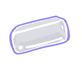
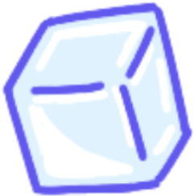

# Sip the Bubble

**Sip the Bubble** is an engaging 2D game where you control a straw to collect pearls floating in a colorful bubble tea world. Use your suction power to gather pearls while managing your energy and avoiding obstacles. It’s a fun, fast-paced experience that tests your timing, precision, and energy management skills.

---

## Table of Contents

- [Introduction](#introduction)
- [Gameplay](#gameplay)
- [Controls](#controls)
- [Hints & Tips](#hints--tips)
- [Installation](#installation)
- [Credits](#credits)
- [License](#license)

---

## Introduction

In *Sip the bubble*, your goal is to collect as many pearls as possible by using your straw’s suction power to draw them in.
Your suction power depletes over time, and you must manage your energy to avoid running out before you’ve collected enough pearls.

---

## Gameplay

- **Objective:** Collect pearls by using your straw to suck them in, all while managing energy and avoiding obstacles.
- **Energy Management:** Your suction power is limited, and it slowly recharges over time.
- **Obstacles:** Bubbles and other objects in the environment will slow you down or block your way.
- **Score:** Each pearl you collect adds to your score. The goal is to collect as many as possible!

---

## Controls

- **Press F to insert straw:** Insert the straw into the bubble tea to begin collecting pearls. The straw will move toward the target position when activated.
- **Press Q to stop insert:** Stops the straw from moving forward and halts the insertion process.
- **press R to shake the cup:** Shake the cup to change the positioning of pearls or affect their movement, adding some unpredictability to the gameplay.
- **Press ESC to return to the initial state:** Pressing the ESC key will reset the game to the initial state, allowing you to start over or exit certain activities.
- **Spacebar:** Press to activate suction and start drawing pearls toward your straw.
- **Energy Bar:** Monitor your energy usage. Energy depletes when using suction and recharges over time.

---

## Hints & Tips

- **Use Precision:** Small, accurate movements are often more effective than full suction power.
- **Manage Your Energy:** Wait for your energy to recharge between suction uses. Don’t waste it all at once!
- **Timing Is Key:** Observe the pearl’s movement patterns and use suction at the right moment.
- **Avoid Obstacles:** Be cautious of bubbles and other objects that might block your straw or slow you down.

---

## Special Ingredients (小料)

In **Sip the Bubble**, there are several special ingredients (also known as "toppings") that float in the bubble tea. Each topping has its own unique characteristics and contributes differently to your score. Here’s a breakdown of each topping, along with how they affect your game.

### **Pearl** (珍珠) – **15 Points**
Pearls are the highest-scoring topping in the game, worth **15 points** each! They’re scattered throughout the bubble tea and are the main collectible item. Pearls are easy to suck up with the straw, and they provide the majority of your score.

- **Points:** 15
- **Description:** Easy to collect, the main source of points. Collect as many as you can!

### **Coconut Jelly** (椰果) – **10 Points**
Coconut Jelly, or **椰果**, has a unique characteristic: it can only be collected if it's upright. This adds a level of difficulty to collecting it. If the coconut jelly is lying down, you’ll need to rotate the straw or wait for it to stand up to collect it. 

- **Points:** 10
- **Description:** Requires careful positioning of the straw to collect. If it’s lying flat, you’ll need to make it stand up first!

### **Taro Balls** (芋圆) – **5 Points**
Taro Balls are tiny and easy to suck up. Because of their small size, they only give **5 points** each. They’re great for quickly racking up some score when you’re in a pinch!

- **Points:** 5
- **Description:** Small and easy to collect, but they only contribute a small amount to your score.

### **Ice Cube** (冰块) – **-10 Points**
Ice Cubes are tricky. They slowly melt over time, and once sucked up, they actually **subtract 10 points** from your score! Be careful not to collect too many of these, or they’ll end up hurting your score.

- **Points:** -10 (when collected)
- **Description:** Ice cubes slowly melt over time and will subtract points if sucked up. Avoid them if you want to maximize your score!

---

## Installation

1. Clone or download the project repository.
2. Open the project in **Unity** (preferably version 2020.3 or later).
3. Set up the project environment and build for your platform (Windows, macOS, etc.).
4. Play the game in Unity or export it for standalone play.

---

## Credits

- **Developer:** [ZhuoYuan Zhan, ZhiKang Shi, TianYi Bao, ShaoBo Jiang]
- **Function Design:** [ZhiKang Shi]
- **Skill And Animation design:** [ZhuoYuan Zhan]
- **Level Design:** [ShaoBo Jiang]
- **Art:** [TianYi Bao]
- **Special Thanks:** [Peter Ng]

---

## License

This game is licensed under the [MIT License](LICENSE).
